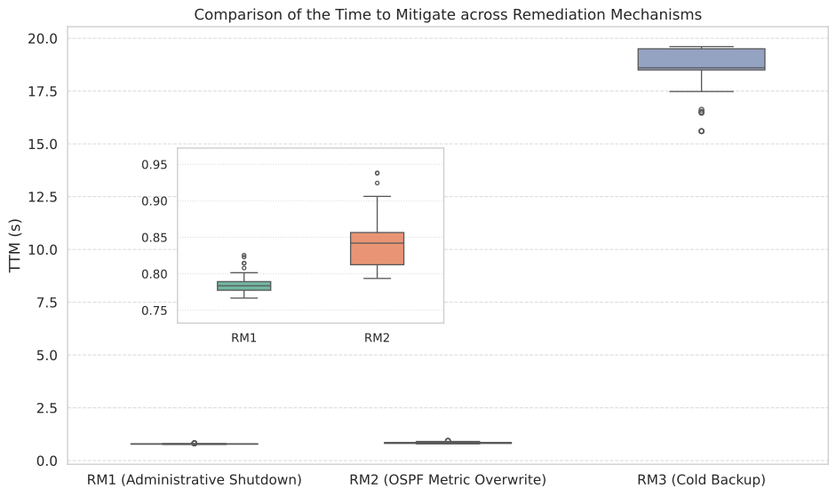

# Self-Healing Network Architecture for Gray Failures

[](#)
[](#)
[](#)
[](#)
[](#)

**Automated Network Reconfiguration via Ansible & Prometheus in Proxmox VE.**

## Problem & Solution
* **Problem:** Gray failures (like creeping packet loss) evade traditional routing protocol detection, leading to silent degradation and poor network health without triggering standard failover mechanisms.
* **Solution:** A reactive Automation approach. By integrating Prometheus observability with Ansible-driven Network-reconfigurations, this architecture detects degradation in real-time and dynamically applies remediation-strategies to restore network integrity.

---

## Closed-Control-Loop

The system relies on a continuous closed-control-loop:



1. **Monitor:** ICMP Probing utilizing `Blackbox Exporter` to check for Packet Loss on Links.
2. **Analyze:** `Prometheus` analysis of Packet Loss occurrence to ensure Gray-Failure existence.
3. **Plan:** Prometheus `Alertmanager` and a `Python Webhook` receive Prometheus FIRING alerts and choose the remediation-mechanic.
4. **Execute:** Execution of `Ansible` playbook containing the chosen remediation-mechanic is triggered.
---

## Evaluation

The thesis evaluated the MAPE-K **Execute** phase in isolation. Three remediation mechanisms (RM1–RM3) were compared against Time-to-Mitigate (TTM), cumulative packet loss, and established resilience design principles.

The plot below compares TTM across 100 consecutive trials per mechanism, measured from the Prometheus `FIRING` event to the first packet received via a healthy link.



Executed within the closed-loop, Administrative Shutdown (RM1) and OSPF Metric Overwrite (RM2) achieve average sub-second mitigation. In contrast, an unoptimized Cold Backup (RM3) takes approximately 18.5 seconds on average, illustrating the inherent trade-off between remediation speed and the resource efficiency of a passive cold standby.

## Repository Structure (Upcoming)

```text
.
├── ansible/             # Ansible playbooks
├── architecture/        # Architecture diagrams
├── configs/             # Configuration files
├── docs/                # Other documentation
├── src/                 # Webhook logic
├── .gitignore           # Git ignore rules for clean commits
└── README.md            # Project documentation (You are here)