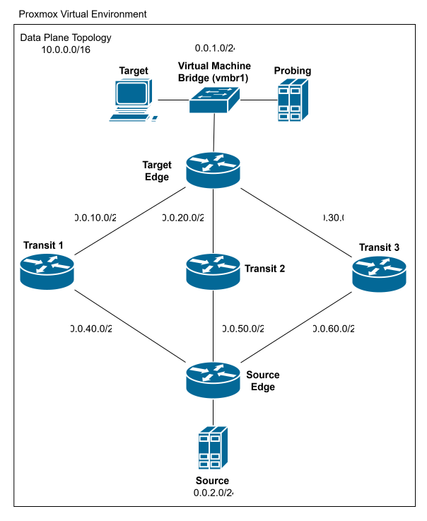
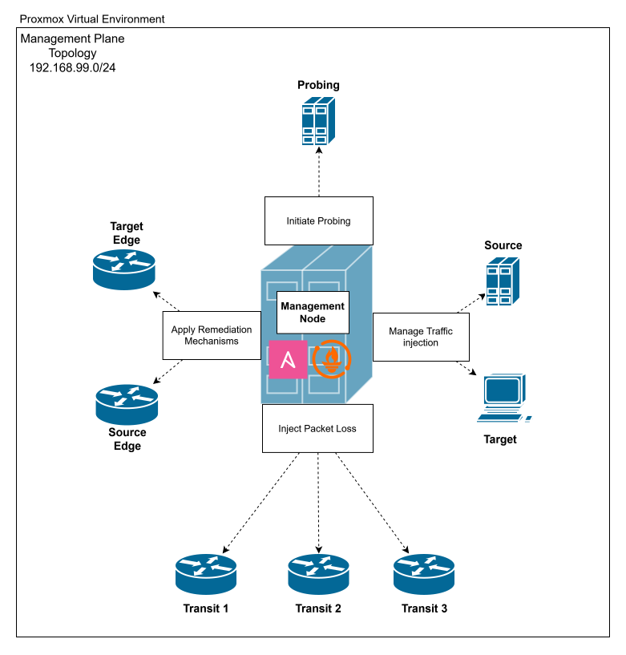
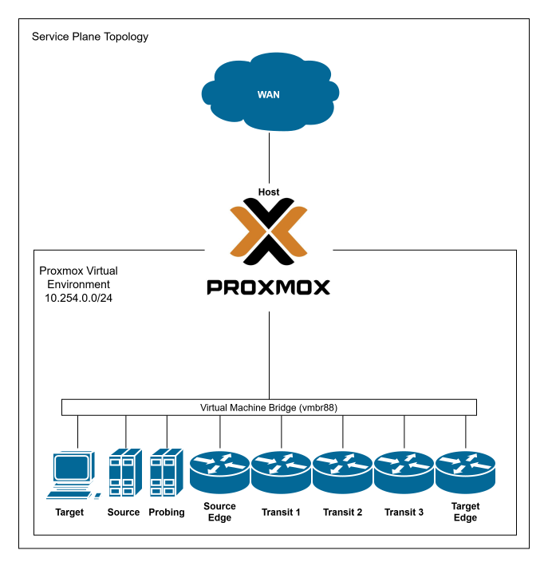

# Architecture Documentation

This folder contains architecture diagrams for the Proxmox Virtual Environment.

To ensure separation of concerns, the network topology is divided into three logical planes:

## 1. Data Plane
The Data Plane visualizes the path of the actual data traffic. It shows how traffic is routed between the Source and Target network.



## 2. Management Plane
The Management Plane shows the Management Network and provides information about the tasks the Management Node executes on all other nodes.



## 3. Service Plane
The Service Plane provides an overview of the nodes' connectivity to the WAN via the Proxmox Host for service purposes, such as installing required software in the testbed.



---

## Directory Structure

```text
.
├── data_plane.svg           # Data Plane diagram
├── data_plane.drawio        # Editable Data Plane Draw.io source file
├── management_plane.svg     # Management Plane diagram
├── management_plane.drawio  # Editable Management Plane Draw.io source file
├── service_plane.svg        # Service Plane diagram
├── service_plane.drawio     # Editable Service Plane Draw.io source file
└── README.md                # Architecture documentation (You are here)
